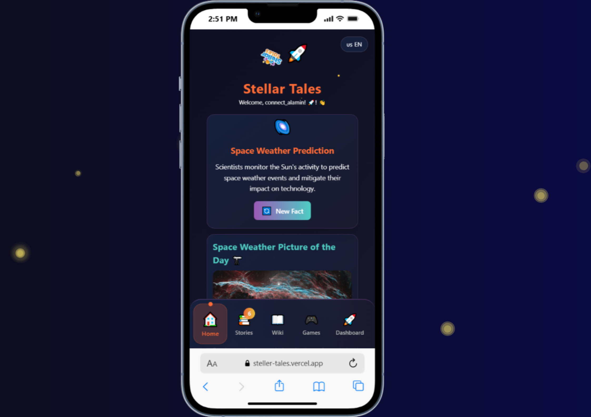
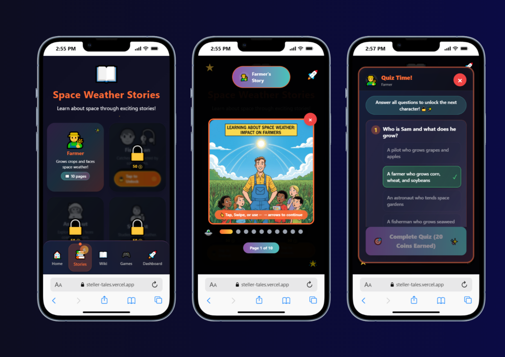
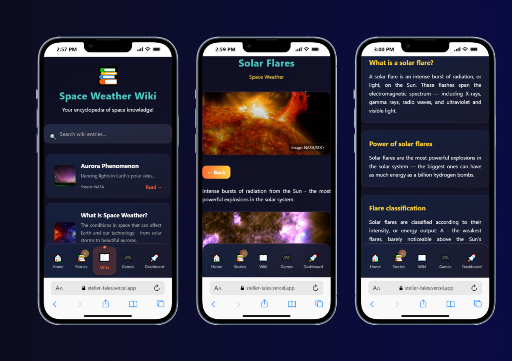
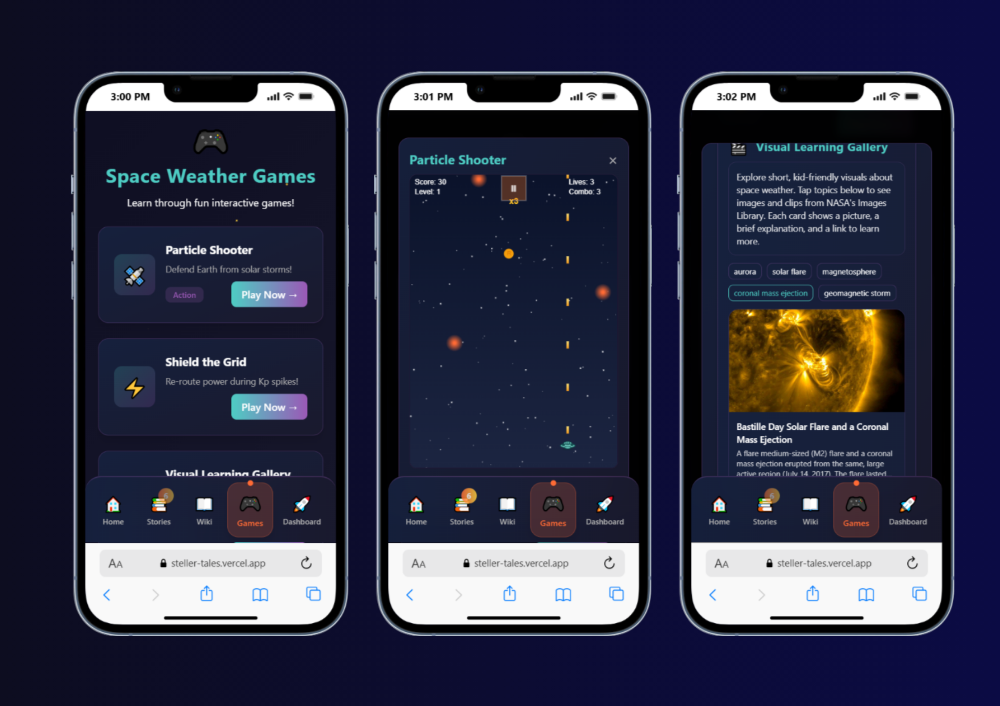
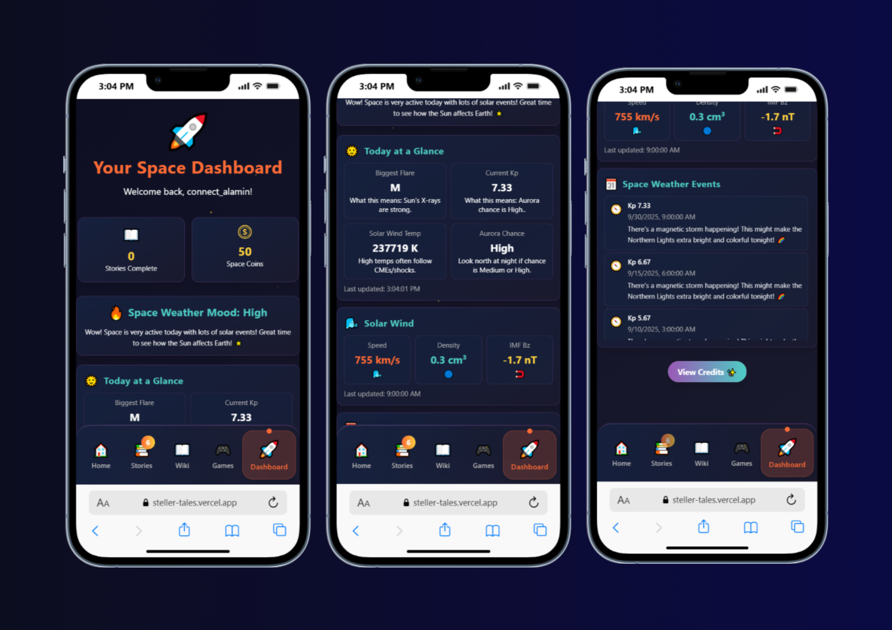

# 🌌 Stellar Tales — 2025 NASA Space Apps Challenge

- **Challenge**: Stellar Stories: Space Weather Through the Eyes of Earthlings  
- **Team**: Team Nomads (6 Members)  
- **Deployment**: [https://steller-tales.vercel.app](https://steller-tales.vercel.app)

---

## 📘 Project Summary

Stellar Tales is an educational Progressive Web App (PWA) for kids (ages 6–15) to explore how space weather impacts everyday life. It blends story‑driven learning, a wiki, interactive mini‑games, and live NASA/NOAA space weather data to make complex science approachable and exciting.

---

## 🎥 Project Demonstration

- Live App: [https://steller-tales.vercel.app](https://steller-tales.vercel.app)  
- Source: [https://github.com/Hackovate/steller-tales](https://github.com/Hackovate/steller-tales)

---

## 🧭 How We Addressed the Challenge

We built a cross‑platform PWA that turns real space weather data into kid‑friendly narratives and activities:

- Role‑based stories show practical impacts (pilot, farmer, fisherman, scientist, astronaut, electrician)
- Interactive dashboard visualizes solar wind, flares, Kp index, aurora maps
- Games and quizzes reinforce learning with instant feedback
- Multilingual interface broadens accessibility

---

## 🏗️ How We Developed This Project

- Frontend with React + Vite and Tailwind for a fast, mobile‑first UI
- React Context for app, user, and language state management
- Data layer integrates NASA DONKI, NOAA/SWPC, APOD, and NASA Images APIs
- Deployed on Vercel with environment‑based configuration
 - Progressive Web App (PWA): installable experience with app‑like UX
 - Internationalization: multi‑lingual UI (English, Bangla, Hindi, French, Spanish)

---

## 🎯 Goals

- Educate: Explain how solar storms and flares affect daily life
- Engage: Use stories, visuals, and games to motivate learning
- Empower: Integrate real NASA/NOAA data for authenticity
- Inspire: Spark curiosity about space science and STEM careers

---

## 🌟 Highlighted Features

- Progressive Web App: Offline support, responsive, fast
- Role‑Based Impact Stories: Six professions with tailored scenarios
- Real‑Time Dashboard: Solar wind gauges, alerts, flares, Kp forecast, historical comparisons
- Interactive Aurora Maps: Live hemispheric maps from NOAA SWPC with clickable hotspots
- Aurora Forecast Game: Real-time aurora prediction with location-based viewing guides
- Historical Aurora Events: Timeline of major geomagnetic storms (Carrington Event, Halloween Storms, etc.)
- Mini‑Games: Particle Shooter (with BGM), Shield the Grid, Aurora Forecast, 110+ quiz questions
- Visual Gallery: NASA APOD and imagery with fallbacks
- Offline Support
- Multilingual: English, Bangla, Hindi, French, Spanish

---

## 🎮 Mini‑Games

- Aurora Forecast Game — Interactive aurora forecasting with real-time NOAA data and clickable hotspots for Northern/Southern hemispheres
- Shield the Grid — Strategy/Tower Defense; protect power infrastructure from geomagnetic storms
- Solar Particle Shooter — Action/Arcade with background music; navigate solar particle streams
- Visual Learning Game — Recognize solar phenomena with NASA imagery (adaptive difficulty)
- Space Weather Quiz — 110+ multiple‑choice and true/false questions with detailed explanations
- Wiki-Specific Quizzes — Targeted quizzes for each wiki topic with instant feedback

---

## 📱 App Walkthrough

1) Onboarding → Name, age, language selection  
2) Home → Trivia, highlights, Today at a Glance with historical comparisons, navigation to Stories, Dashboard, Wiki, Games  
3) Stories → Profession‑based narratives with visuals and impacts  
4) Dashboard → Live alerts, solar wind indicators, interactive aurora forecast game with hotspots, historical aurora events timeline  
5) Wiki → Solar phenomena, celestial events, NASA missions, 150+ interactive quizzes  
6) Games → Aurora Forecast, Particle Shooter (with BGM), Shield the Grid, comprehensive quiz system

---

## 🧩 Wiki Coverage

- Solar Phenomena: Flares, CMEs, Solar Wind, Sunspot Cycles  
- Celestial Events: Aurora, Geomagnetic Storms, Magnetosphere  
- NASA Missions: Parker Solar Probe, SDO, STEREO, SOHO

---

## 🛠 Architecture Overview

- Framework: React 18 + Vite  
- Styling: Tailwind CSS (mobile‑first, space theme)  
- State: React Context (App, User, Language)  
- Data: NASA DONKI, APOD, NASA Images, NOAA SWPC  
- Deploy: Vercel

Data flow: NASA/NOAA APIs → `/src/utils/nasaAPI.js` & `/src/utils/swpcAPI.js` → Context → Components → Pages

---

## 🤖 Use of Artificial Intelligence (AI)

- **Claude / ChatGPT / Qwen**: Idea generation and content drafting  
- **Perplexity**: Researching facts, references, and API details  
- **Nano Banana**: Comic book creation and visual storytelling support  

---

## 📂 Directory Structure

root/  
 ├── public/ (PWA assets, logos, story/wiki media)  
 │   ├── manifest.json  
 │   ├── sw.js  
 │   ├── wiki/ (images/videos for wiki)  
 │   └── stories/ (role‑based story images)  
 ├── src/  
 │   ├── pages/ (Home, Stories, Dashboard, Wiki, Games)  
 │   ├── components/ (UI & feature components)  
 │   ├── context/ (App, User, Language)  
 │   ├── data/ (Story & wiki content, quizzes)  
 │   ├── utils/ (API integration & helpers)  
 │   └── assets/ (Icons, static vectors)  
 ├── .env  
 ├── vite.config.js  
 └── package.json

---

## 🔗 Data Sources & Attribution

Primary Endpoints:  
- SWPC Alerts: `https://services.swpc.noaa.gov/products/alerts.json`  
- GOES X‑ray (1‑day): `https://services.swpc.noaa.gov/json/goes/primary/xrays-1-day.json`  
- Solar wind (mag): `https://services.swpc.noaa.gov/products/solar-wind/mag-1-day.json`  
- Solar wind (plasma): `https://services.swpc.noaa.gov/products/solar-wind/plasma-1-day.json`  
- Kp 3‑day forecast: `https://services.swpc.noaa.gov/products/3-day-forecast.json`  
- Aurora map (NH): `https://services.swpc.noaa.gov/images/aurora-forecast-northern-hemisphere.png`  
- Aurora map (SH): `https://services.swpc.noaa.gov/images/aurora-forecast-southern-hemisphere.png`  
- Sun images: `https://services.swpc.noaa.gov/images/suvi/suvi-latest-195.jpg`, `https://services.swpc.noaa.gov/images/sxi/sxi-latest.jpg`

NASA DONKI (requires api.nasa.gov key):  
- Flares (FLR): `https://api.nasa.gov/DONKI/FLR?...`  
- CME: `https://api.nasa.gov/DONKI/CME?...`  
- CME Analysis: `https://api.nasa.gov/DONKI/CMEAnalysis?...`  
- Geomagnetic storms (GST): `https://api.nasa.gov/DONKI/GST?...`  
- Solar energetic particles (SEP): `https://api.nasa.gov/DONKI/SEP?...`  
- Notifications: `https://api.nasa.gov/DONKI/notifications?...`

NASA Images & APOD:  
- Images API: `https://images-api.nasa.gov/search?q=aurora&media_type=image`  
- APOD: `https://api.nasa.gov/planetary/apod?api_key=YOUR_KEY`

---

## ⚙️ Setup & Development

Requirements: Node.js 18+, npm 9+  
Install & Run:  
`npm install`  
`npm run dev`  
Open → `http://localhost:5173`

Build:  
`npm run build`  
`npm run preview`

Configuration (.env):  
`VITE_NASA_API_KEY=provided_by_nasa_spaceapps`

---

## 🔒 Caching & Offline Support

- **Service Worker v8** with smart caching (excludes HTTP 206 responses)
- **Cache Strategy**: Static (7 days), Media (30 days), API Data (180 minutes)
- **Full Offline Mode**: All stories, wikis, games, and quizzes work without internet
- **Offline Detection**: User-friendly error messages and fallback content

---

## 🧩 Accessibility

- High contrast, kid‑friendly fonts  
- Large touch targets  
- Short sentences paired with visuals

---

## 👥 Team Nomads

- Al Amin — Team Lead & Vision Strategist  
- Sayed Ajlan Al Alif — System Designer & Experience Architect  
- Mehrab Hossain — Developer & Creative Technologist  
- Ebrahim Hossain — Researcher, Data Integration  
- Fardin Hossain — Researcher, Story Content & Outreach  
- Shakera Ema — Researcher, Space Weather Impacts

---

## 🖼️ App Interface Gallery

Below are key screens of the app interface (from `public/app_interface/`):

---

## 📌 Notable Components

- `AuroraForecastGame.jsx` — Interactive aurora forecast with NOAA real-time data and offline detection
- `AuroraHotspotOverlay.jsx` & `AuroraHotspotModal.jsx` — Clickable aurora viewing locations for both hemispheres
- `TodayAtAGlance.jsx` — Space weather summary with historical event comparisons
- `QuizModal.jsx` & `QuizCompletionModal.jsx` — 110+ wiki-specific quiz questions with instant feedback
- `SolarParticleShooter.jsx` — Action game with background music and particle physics education
- `VisualGallery.jsx` — NASA imagery with fallback explanations  
- `AlertsTicker.jsx` — Live space weather alerts  
- `ImpactStoryPanels.jsx` — Role‑based interactive stories  
- Games (React‑based) — Kid‑oriented learning experiences with enhanced offline support

---

## 📜 License & Credits

- MIT License (see `LICENSE`)  
- Media & Data: © NASA, NOAA (public usage guidelines)

### 🎵 Music (Video)

- **Track**: [Track Name] by Neutrin05 — used in the project demonstration video
  - **License**: [Creative Commons BY 4.0](https://creativecommons.org/licenses/by/4.0/)
  - **Source**: https://www.youtube.com/watch?v=lvOcMJ3gLFQ
  - **Artist Social**: [@neutrin05](https://www.youtube.com/@neutrin05)

### 🎵 Background Music - Particle Shooter Mini-Game

- **Track**: "Action loop E 90 BPM" by BRVHRTZ
- **Source**: [Pixabay](https://pixabay.com/sound-effects/action-loop-e-90-bpm-brvhrtz-233462/)
- **License**: Pixabay Content License (royalty-free)
- **Usage Context**: Background audio for interactive particle shooter mini-game
- **Educational Purpose**: Enhances user engagement while learning about space weather particle interactions

- **Disclaimer**: Music serves as supporting audio content. Core innovation lies in NASA space weather data integration and educational game mechanics.

---

